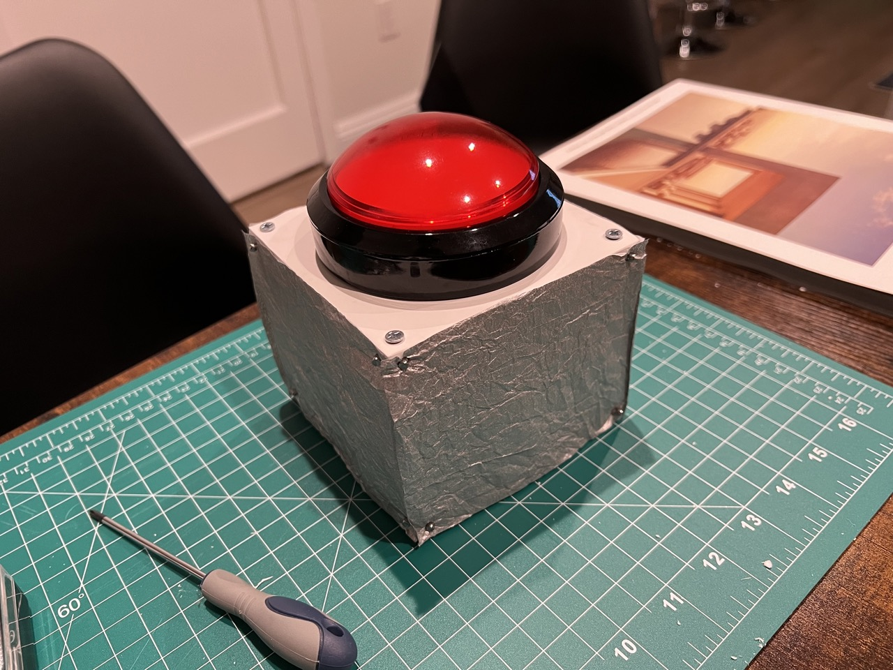
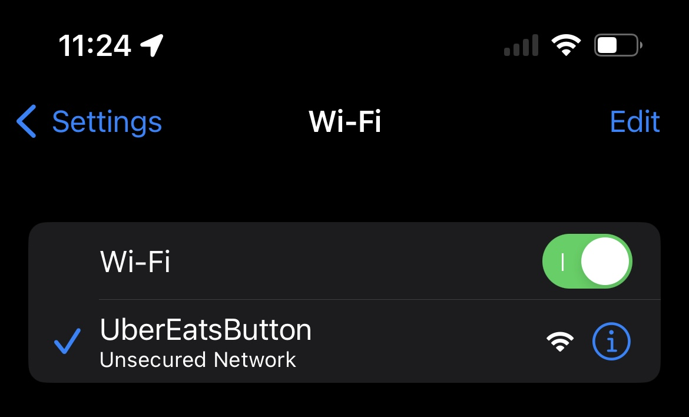
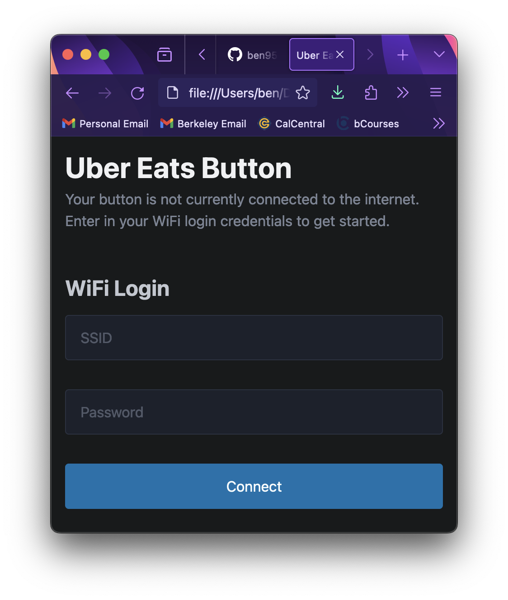

# Uber Eats Button

*A physical, big red button that orders a random meal to your house*


*The Button in all its Glory*

## About

The Uber Eats Button is a big red button that uses some AI and randomness to pick out some food items on Uber Eats that constitute a meal and orders it to your house without any human intervention.

The button itself (pictured above) is Raspberry Pi Pico W running MicroPython, hooked up to a button and an LED inside the button. When the button is plugged into a power source, it tries connecting to a WiFi network using the SSID and password saved to storage. If it fails, it goes into AP mode and appears as a WiFi network to any other device.


*How the Uber Eats Button Access Point Appears upon Connecting*

You can use a phone or computer to connect to the button and visit the button's website (run by a from-scratch, barebones HTTP server). This lets you change the saved SSID and password, and the button will attempt to connect to the network again.


*Login Form to Connect the Button to the Internet*

When the button successfully connects to the WiFi network and syncs with the NTP timeserver (necessary for signing JWT requests), the LED will light up for a few seconds, letting the user know the button is ready to use.

Upon pressing the button, the Pico detects the voltage change and makes a PUT request to the configured server at `/order`. The body of the request is empty but the Authorization header is `Bearer` with a JSON Web Token (JWT) of the following form:

```json
{
  "sub": "random-order",
  "iss": process.env.JWT_ISSUER,
  "aud": process.env.JWT_AUDIENCE,
  "jti": [new UUIDv4()],
  "iat": [now - 10 seconds],
  "exp": [now + 60 seconds]
}
```

The `sub` is always `"random-order"` and defines the request type. `iss` and `aud` identify the client and server, respectively. This way if you theoretically had multiple clients/servers, the request is only good for one pair. `jti` serves as an idempotency token that the server checks to prevent replay attacks. `iat` and `exp` define the lifespan for the request. The former is 10 seconds before the request to account for any discrepencies in timekeeping between the client and server.

The request uniquely identifies a client request and ensures that no one can create a fake request. The JWT is signed by a shared secret that only the server and client know.

When the server receives the request, it validates the authenticity and creates a Puppeteer headless Chrome browser instance. It opens a tab and navigates to the Uber Eats website where it attempts to load any saved credentials into the browser cookies. These credentials are the `sid` cookie for `.ubereats.com` and the `sid` and `csid` cookies for `auth.uber.com`.

If, when navigating back to the Uber Eats website the user is logged in, it moves on. Otherwise, it attempts to log in with a configured email and waits for the two-factor authentication code to be sent. It then opens a new tab to a configured Roundcubemail client, logs in, waits for the email, opens it, reads the code, then navigates to the original tab and enters it.

## Caveats

The environment variables are not visible to the Raspberry Pi Pico. There may be some way to make this work, but I couldn't figure it out. Necessary constants are either hard-coded in or saved to text files on the Pico itself.

I know the Pico sends the request over HTTP (not HTTPS). This is because I didn't have HTTPS set up on the server until after I no longer had physical access to the button to update its code. In principal though this should be fine, since the requests themselves don't contain sensitive data and the payload is signed by a shared secret that never leaves the client or server. The payload also has an expiration time and replay attacks are defended against on the server with an idempotency token.

You will need a machine with non-trivial processing power and memory to run the server. Puppeteer is basically just Google Chrome after all and even if your system runs it, the Uber Eats website is laggy and might not load in time for everything to work.

The server looks for the two-factor authentication email by looking for a new email to show up on Roundcubemail. This assumes that no other emails arrive between the time of the 2fa request and the 2fa email arriving. This isn't a problem for me but just something to keep in mind.